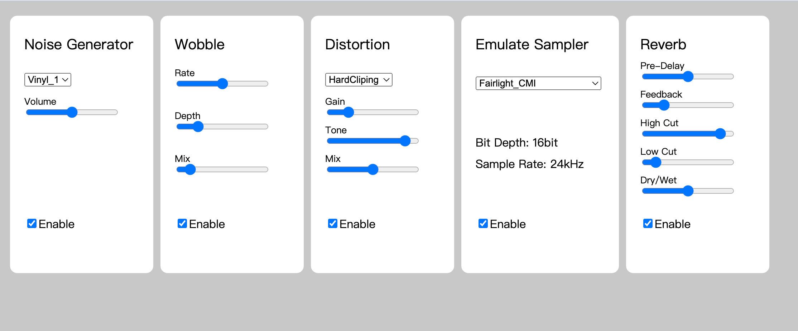

# Vintage-Effect
A vintage tape recorder and environment digital effects implemented in the Bela platform using C++. This vintage effect is included a Noise Generator to add vinyl or other noise sounds, a wobble effect to make the audio tremble, three types of distortions, a sampler to emulate four types of old-school recorders and a reverb to add a sense of space.

